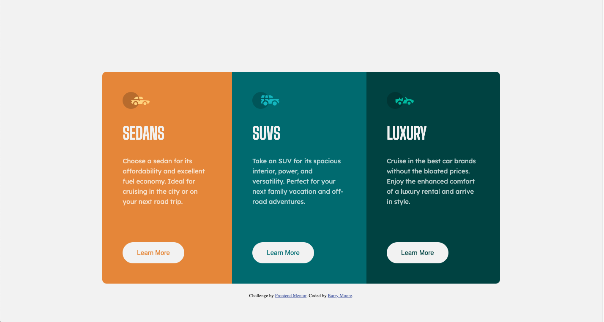
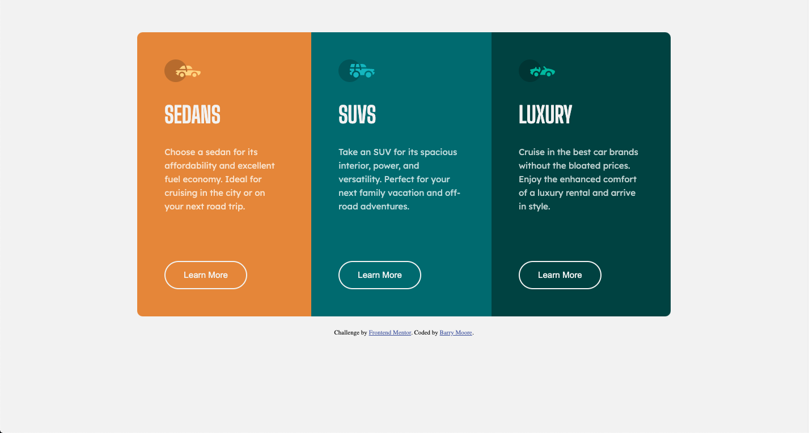
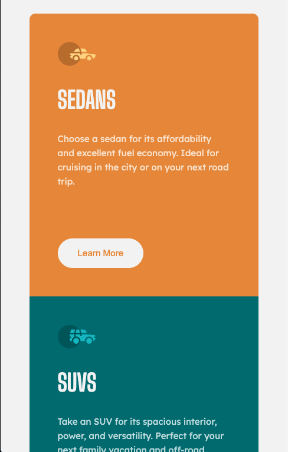

# Frontend Mentor - 3-column preview card component solution

This is a solution to the [3-column preview card component challenge on Frontend Mentor](https://www.frontendmentor.io/challenges/3column-preview-card-component-pH92eAR2-). Frontend Mentor challenges help you improve your coding skills by building realistic projects.

This was a fun and simple one to do.

## Table of contents

- [Overview](#overview)
  - [The challenge](#the-challenge)
  - [Screenshot](#screenshot)
  - [Links](#links)
- [My process](#my-process)
  - [Built with](#built-with)
  - [What I learned](#what-i-learned)
  - [Continued development](#continued-development)
  - [Useful resources](#useful-resources)
- [Author](#author)
- [Acknowledgments](#acknowledgments)

## Overview

### The challenge

Users should be able to:

- View the optimal layout depending on their device's screen size
- See hover states for interactive elements

### Screenshots

Desktop View

Hover State

Mobile View 1

Mobile View 2

### Links

- Solution URL: [Frontend Mentor Solution](https://www.frontendmentor.io/solutions/mobile-first-3-column-display-KjB8xAY9w)
- Live Site URL: [Live Site](https://bmoore15v.github.io/FM-3-Column-Peview-Card/)

## My process

### Built with

- Semantic HTML5 markup
- Custom CSS properties
- Flexbox
- Mobile-first workflow

### What I learned

This was a pretty quick solution to figure out. I began by using `display: grid` but had issues figuring out how to set the margins correctly. After fudging around with it for a while, I decided to go with Flexbox for the layout and that made things simpler.

### Continued development

I would like to better understand when and how to use grid layout. I know it is a powerful tool and perhaps this solution was too simple for it to be an effective tool. Flexbox was a simpler implementation. However, I want to learn to implement `display: grid` better.

### Useful resources

- [Grid Design by Kevin Powell](https://www.youtube.com/watch?v=duH4DLq5yoo) - Kevin Powell did a great job explaining grid and how to use it. It will definitely come back to his video to further learn how to implement `display: grid`

## Author

- Website - [To Work & Keep](https://www.toworkandkeep.com)
- LinkedIn - [Let's Connect](https://www.linkedin.com/in/bmoore15v/)
- Frontend Mentor - [@bmoore15v](https://www.frontendmentor.io/profile/bmoore15v)
- Twitter - [@bmoore15v](https://www.twitter.com/bmoore15v)

## Acknowledgments

Thanks to [Dr. Angela Yu](https://www.udemy.com/user/4b4368a3-b5c8-4529-aa65-2056ec31f37e/) and her [Web Development Bootcamp Course](https://www.udemy.com/course/the-complete-web-development-bootcamp/) on Udemy. I have made tremendous strides understanding the fundamentals of Web Development and in turn being able to complete this challenge as quickly as I did with her help.

